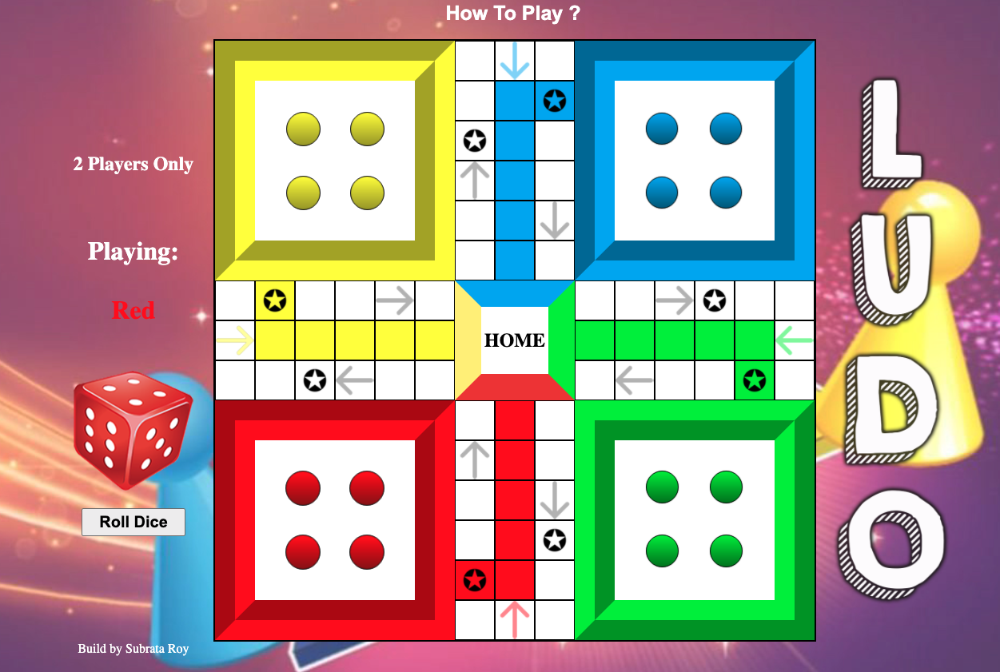

# LUDO

[Play Here](https://subrataroy321.github.io/LUDO/)

## What is ludo?

Ludo (/ˈljuːdoʊ/; from Latin ludo, meaning 'I play') is a strategy board game for two to four[a] players, in which the players race their four tokens from start to finish according to the rolls of a single die. Like other cross and circle games, Ludo is derived from the Indian game Pachisi, but simpler. The game and its variations are popular in many countries and under various names.

## How to play ?

~ Players alternate turns in a clockwise direction.

~ To enter a token into play from its yard to its starting square, a player must roll a 6. The player has to draw a token from start home every time he gets a 6 unless start home is empty or the start box has 2 own tokens (is doubled). If the player has no tokens yet in play and rolls other than a 6, the turn passes to the next player.

~ Players must always move a token according to the die value rolled.

~ Once a player has one or more tokens in play, he selects a token and moves it forwards along the track the number of squares indicated by the die.

~ Rolling a 6 earns the player an additional or "bonus" roll in that turn. If the bonus roll results in a 6 again, the player earns again an additional bonus roll. If the third roll is also a 6, the player may not move and the turn immediately passes to the next player.

~ If the advance of a token ends on a square occupied by an opponent's token, the opponent token is returned to its owner's yard. The returned token can be reentered into play only when the owner rolls a 6.

~ A player's home column squares are always safe since no opponent may enter them. In the home column, you cannot jump over your token. Roll the exact number needed to get each token onto the center home.

Want to know more: [click here](https://en.wikipedia.org/wiki/Ludo_(board_game))

## Softwares used

This is a web based game. It is built using HTML, CSS and JavaScript Programing.

## Code Snippets of Some Functions

```js
    function diceRoller() {
        removeRollDiceClick();
        diceRollSound.play();// dice rolling sound
        diceNum = (Math.floor(Math.random()*6))+1;
        if(diceNum === 1) {
            dice.src = './images/roll-dice.png';
            setTimeout(function() {
                dice.src = './images/dice1.png';
                dice.alt = '1';
                document.getElementById('roll-again').textContent = '';
                detectPlayer();
            },1000);
        }else if(diceNum === 2) {
            dice.src = './images/roll-dice.png';
            setTimeout(function() {
                dice.src = './images/dice2.png';
                dice.alt = '2';
                document.getElementById('roll-again').textContent = '';
                detectPlayer();
            },1000);
        } else if(diceNum === 3) {
            dice.src = './images/roll-dice.png';
            setTimeout(function() {
                dice.src = './images/dice3.png';
                dice.alt = '3';
                document.getElementById('roll-again').textContent = '';
                detectPlayer();
            },1000);
        } else if(diceNum === 4) {
            dice.src = './images/roll-dice.png';
            setTimeout(function() {
                dice.src = './images/dice4.png';
                dice.alt = '4';
                document.getElementById('roll-again').textContent = '';
                detectPlayer();
            },1000);
        }else if(diceNum === 5) {
            dice.src = './images/roll-dice.png';
            setTimeout(function() {
                dice.src = './images/dice5.png';
                dice.alt = '5';
                document.getElementById('roll-again').textContent = '';
                detectPlayer();
            },1000);
        }else if(diceNum === 6) {
            dice.src = './images/roll-dice.png';
            setTimeout(function() {
                dice.src = './images/dice6.png';
                dice.alt = '6';
                document.getElementById('roll-again').textContent = 'Roll Again'; 
                detectPlayer();
            },1000);
        }
    }
    
```

This function rolls when it is called. Using javascript function `(Math.floor(Math.random()*6))+1;` returns a random number between a 1-6 and render an image od dice. Also it checks which player is playing the game and allows that player to make move if possible.

```js
    function moveRedCircle(event){
        removeEventRedOn();
        moveSound.play();
        // if else statement checks if there redcircles already exsists if exsists, gets a different number like redOn0, redOn1, redOn2
        if (redOnCount === 0) {
            event.target.classList.remove('red-circle');
            rStart.classList.add('redActive','redOn0');
            rStart.id = 0;
            redOnCount++;
            removeEventRedCircle(event);
            rollDiceClick();
        } else if (redOnCount === 1) {
            event.target.classList.remove('red-circle');
            rStart.classList.add('redActive','redOn1');
            rStart.id = 0;
            redOnCount++;
            removeEventRedCircle(event);
            rollDiceClick();
        } else if (redOnCount === 2) {
            event.target.classList.remove('red-circle');
            rStart.classList.add('redActive','redOn2');
            rStart.id = 0;
            redOnCount++;
            removeEventRedCircle(event);
            rollDiceClick();
        } else if (redOnCount === 3) {
            event.target.classList.remove('red-circle');
            rStart.classList.add('redActive','redOn3');
            rStart.id = 0;
            redOnCount++;
            removeEventRedCircle(event);
            rollDiceClick();
        }
    };
```

This function move a red circle / red token from its start home yard/box to the game board.

```js
    function moveBlueOn(e) {
        removeEventBlueCircle();
        moveSound.play();
        blueTargetId = diceNum + parseInt(e.target.id);
        if (e.target.classList.value.includes('blueOn2') && e.target.classList.value.includes('blueOn3')) {
            e.target.classList.remove('blueOn3');
            blueMoveArray[blueTargetId].classList.add('blueActive','blueOn3');
            blueMoveArray[blueTargetId].id = blueTargetId;
            removeBlueEventSwitchPlayer();
        } else if (e.target.classList.value.includes('blueOn1') && e.target.classList.value.includes( 'blueOn3')) {
            e.target.classList.remove('blueOn3');
            blueMoveArray[blueTargetId].classList.add('blueActive','blueOn3');
            blueMoveArray[blueTargetId].id = blueTargetId;
            removeBlueEventSwitchPlayer();
        } else if (e.target.classList.value.includes('blueOn0')&& e.target.classList.value.includes( 'blueOn3')) {
            e.target.classList.remove('blueOn3');
            blueMoveArray[blueTargetId].classList.add('blueActive','blueOn3');
            blueMoveArray[blueTargetId].id = blueTargetId;
            removeBlueEventSwitchPlayer();
        } else if (e.target.classList.value.includes('blueOn3')) {
            e.target.classList.remove('blueActive','blueOn3');
            removeRedActive(blueTargetId);
            blueMoveArray[blueTargetId].classList.add('blueActive','blueOn3');
            blueMoveArray[blueTargetId].id = blueTargetId;
            removeBlueEventSwitchPlayer();
        } else if (e.target.classList.value.includes('blueOn1') && e.target.classList.value.includes( 'blueOn2')) {
            e.target.classList.remove('blueOn2');
            blueMoveArray[blueTargetId].classList.add('blueActive','blueOn2');
            blueMoveArray[blueTargetId].id = blueTargetId;
            removeBlueEventSwitchPlayer();
        } else if (e.target.classList.value.includes('blueOn0') && e.target.classList.value.includes( 'blueOn2')) {
            e.target.classList.remove('blueOn2');
            blueMoveArray[blueTargetId].classList.add('blueActive','blueOn2');
            blueMoveArray[blueTargetId].id = blueTargetId;
            removeBlueEventSwitchPlayer();
        }else if (e.target.classList.value.includes('blueOn02')) {
            e.target.classList.remove('blueActive','blueOn2');
            removeRedActive(blueTargetId);
            blueMoveArray[blueTargetId].classList.add('blueActive','blueOn2');
            blueMoveArray[blueTargetId].id = blueTargetId;
            removeBlueEventSwitchPlayer();
        }else if (e.target.classList.value.includes('blueOn0') && e.target.classList.value.includes('blueOn1')) {
            e.target.classList.remove('blueOn1');
            blueMoveArray[blueTargetId].classList.add('blueActive','blueOn1');
            blueMoveArray[blueTargetId].id = blueTargetId;
            removeBlueEventSwitchPlayer();
        } else if (e.target.classList.value.includes('blueOn1')) {
            e.target.classList.remove('blueActive','blueOn1');
            removeRedActive(blueTargetId);
            blueMoveArray[blueTargetId].classList.add('blueActive','blueOn1');
            blueMoveArray[blueTargetId].id = blueTargetId;
            removeBlueEventSwitchPlayer();
        } else if (e.target.classList.value.includes('blueOn0')) {
            e.target.classList.remove('blueActive','blueOn0');
            removeRedActive(blueTargetId);
            blueMoveArray[blueTargetId].classList.add('blueActive','blueOn0');
            blueMoveArray[blueTargetId].id = blueTargetId;
            removeBlueEventSwitchPlayer();
        }
    }
```

This function moves a blue circle/token which is on the board.


## Access the code

If you like to interact with the code or you are trying to make a similar game. Check the code link.

[Code Link](https://github.com/subrataroy321/LUDO)

click  to get a copy of the code into your github profile.


## Build By

Subrata Roy

Connect: [GitHub](https://github.com/subrataroy321) [LinkedIn](http://linkedin.com/in/subrataroy321)


